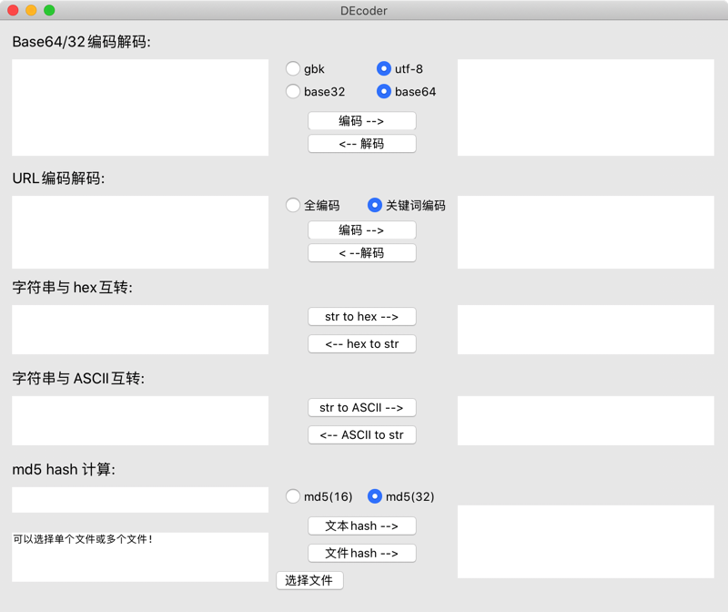

## DEcoder

此项目是我在学习python tkinter时的练手项目，一方面加深对tkinter的掌握，另一方面自己很早之前就想写一款在mac上可以使用的编码解码工具。

代码很简单，都是python和tkinter的基础操作，主要还是为了完成这个小工具，工具界面如下：

由于pyinstaller的原因打包出来的文件有点大，大概22M，不想打包的同学可以直接使用`python3 DEcoder.py`运行程序即可。

打包后的文件放在了**release**中，目前仅打包了mac下使用的`.app`文件，需要的可直接下载，其它平台的可使用pyinstaller打包。

有问题或需求请提issue或者发邮件给我：`hand01@qq.com`
